# System Architecture Diagram

## High-Level Architecture (C4 Model - Level 1)

```mermaid
graph TB
    subgraph "Users"
        EndUser[End User]
        Admin[System Admin]
    end

    subgraph "Web Application"
        WebApp[Jobsprint Web App<br/>Puter.js + Vanilla JS]
    end

    subgraph "System Management"
        TUI[Gum TUI<br/>System Management Interface]
    end

    subgraph "Jobsprint Platform"
        APIGateway[API Gateway<br/>Nginx + Node.js]

        subgraph "Core Services"
            WorkflowEngine[Workflow Engine<br/>n8n]
            AIService[AI Service<br/>Model Abstraction]
            IntegrationService[Integration Service<br/>Zapier MCP]
            AuditService[Audit Service<br/>Logging & Monitoring]
        end

        subgraph "Data Layer"
            PostgreSQL[(PostgreSQL<br/>Primary Data Store)]
            Redis[(Redis<br/>Cache & Sessions)]
            RabbitMQ[RabbitMQ<br/>Message Queue)]
            PuterCloud[Puter.js Cloud<br/>User Files & AI]
        end
    end

    subgraph "External Services"
        ZapierApps[Zapier Apps<br/>30,000+ Integrations]
        FreeAI[Free AI Models<br/>GPT-3.5, Code-Davinci]
        Webhooks[External Webhooks<br/>Third-party Triggers]
    end

    EndUser --> WebApp
    Admin --> TUI
    WebApp --> APIGateway
    TUI --> APIGateway

    APIGateway --> WorkflowEngine
    APIGateway --> AIService
    APIGateway --> IntegrationService
    APIGateway --> AuditService

    WorkflowEngine --> PostgreSQL
    WorkflowEngine --> Redis
    WorkflowEngine --> RabbitMQ

    AIService --> PostgreSQL
    AIService --> Redis
    AIService --> FreeAI
    AIService --> PuterCloud

    IntegrationService --> PostgreSQL
    IntegrationService --> ZapierApps
    IntegrationService --> Webhooks

    AuditService --> PostgreSQL
    AuditService --> Redis

    WebApp --> PuterCloud

    style WebApp fill:#e1f5ff
    style TUI fill:#fff4e1
    style APIGateway fill:#f0e1ff
    style WorkflowEngine fill:#e1ffe1
    style AIService fill:#ffe1e1
    style IntegrationService fill:#ffe1f0
    style PostgreSQL fill:#e1f0ff
    style Redis fill:#f0ffe1
    style PuterCloud fill:#e1e1ff
```

## Container Architecture (C4 Model - Level 2)

```mermaid
graph TB
    subgraph "Client Layer"
        Browser[Web Browser<br/>Modern ES6+]
        Terminal[Terminal<br/>Gum TUI]
    end

    subgraph "Edge Layer"
        Nginx[Nginx Reverse Proxy<br/>SSL Termination<br/>Load Balancing<br/>Static Assets]
    end

    subgraph "Application Layer"
        APIGateway[API Gateway Service<br/>Node.js/Express<br/>Authentication<br/>Rate Limiting<br/>Request Routing]

        subgraph "Workflow Microservice"
            n8nInstance[n8n Instance<br/>Workflow Execution<br/>Node Registry<br/>Scheduler]
        end

        subgraph "AI Microservice"
            AIAdapter[AI Adapter Service<br/>Node.js/Python<br/>Model Abstraction<br/>Prompt Templates<br/>Response Parsing]
        end

        subgraph "Integration Microservice"
            ZapierMCP[Zapier MCP Client<br/>App Connections<br/>Trigger Handlers<br/>Action Executors]
        end

        subgraph "Audit Microservice"
            AuditLogger[Audit Logger<br/>Log Aggregation<br/>Event Streaming<br/>Compliance Reporting]
        end
    end

    subgraph "Data Layer"
        PGPrimary[(PostgreSQL<br/>Primary<br/>Read/Write)]
        PGReplica[(PostgreSQL<br/>Replica<br/>Read Only)]
        RedisCluster[(Redis Cluster<br/>Cache<br/>Sessions<br/>Pub/Sub)]
        RabbitMQCluster[RabbitMQ Cluster<br/>Work Queue<br/>Delay Queue<br/>Dead Letter)]
    end

    subgraph "External Services"
        PuterSDK[Puter.js SDK<br/>Cloud Storage<br/>User Identity<br/>Free AI Models]
        ZapierAPI[Zapier Platform API<br/>30,000+ Apps]
        OpenAIFree[Free AI Endpoints<br/>GPT-3.5-turbo<br/>Code-Davinci]
        WebhookReceivers[External Webhooks<br/>Third-party Systems]
    end

    Browser -->|HTTPS| Nginx
    Terminal -->|SSH/Local| Nginx
    Nginx --> APIGateway

    APIGateway --> n8nInstance
    APIGateway --> AIAdapter
    APIGateway --> ZapierMCP
    APIGateway --> AuditLogger

    n8nInstance --> PGPrimary
    n8nInstance --> PGReplica
    n8nInstance --> RedisCluster
    n8nInstance --> RabbitMQCluster

    AIAdapter --> PGPrimary
    AIAdapter --> RedisCluster
    AIAdapter --> OpenAIFree
    AIAdapter --> PuterSDK

    ZapierMCP --> PGPrimary
    ZapierMCP --> ZapierAPI
    ZapierMCP --> RabbitMQCluster
    ZapierMCP --> WebhookReceivers

    AuditLogger --> PGPrimary
    AuditLogger --> RedisCluster

    Browser --> PuterSDK

    PGPrimary -.->|Replication| PGReplica

    style Nginx fill:#ff6b6b
    style APIGateway fill:#4ecdc4
    style n8nInstance fill:#45b7d1
    style AIAdapter fill:#f9ca24
    style ZapierMCP fill:#6c5ce7
    style AuditLogger fill:#a29bfe
    style PGPrimary fill:#0984e3
    style PGReplica fill:#74b9ff
    style RedisCluster fill:#00b894
    style RabbitMQCluster fill:#e17055
```

## Component Architecture (C4 Model - Level 3)

```mermaid
graph TB
    subgraph "Frontend Application"
        subgraph "Web App Components"
            CoreModule[Core Module<br/>State Management<br/>Event Bus<br/>Utilities]
            UIModule[UI Module<br/>Components<br/>Templates<br/>Styling]
            AIModule[AI Module<br/>Chat Interface<br/>Code Completion<br/>Prompt Builder]
            IntegrationModule[Integration Module<br/>Connection Manager<br/>Workflow Builder<br/>Trigger Tester]
        end

        PuterSDKClient[Puter.js SDK Client<br/>Auth<br/>Storage<br/>AI API]
    end

    subgraph "API Gateway Components"
        AuthMiddleware[Authentication Middleware<br/>JWT Validation<br/>Session Check]
        RateLimiter[Rate Limiter<br/>Token Bucket<br/>User Quotas]
        RequestRouter[Request Router<br/>Service Discovery<br/>Load Balancing]
        ErrorHandler[Error Handler<br/>Exceptions<br/>Fallbacks]
    end

    subgraph "Workflow Engine Components"
        WorkflowExecutor[Workflow Executor<br/>DAG Engine<br/>Node Execution<br/>Error Handling]
        NodeRegistry[Node Registry<br/>Built-in Nodes<br/>Custom Nodes<br/>Validation]
        Scheduler[Scheduler<br/>Cron Jobs<br/>Delayed Triggers<br/>Queue Management]
        StateManager[State Manager<br/>Workflow State<br/>Execution Context<br/>Variables]
    end

    subgraph "AI Service Components"
        ModelAbstraction[Model Abstraction<br/>Provider Interface<br/>Model Selection<br/>Fallback Logic]
        PromptManager[Prompt Manager<br/>Templates<br/>Version Control<br/>A/B Testing]
        ContextManager[Context Manager<br/>Window Management<br/>Token Counting<br/>Retrieval]
        ResponseParser[Response Parser<br/>Validation<br/>Extraction<br/>Formatting]
    end

    subgraph "Integration Service Components"
        ConnectionManager[Connection Manager<br/>OAuth Flow<br/>Credential Store<br/>Token Refresh]
        TriggerHandler[Trigger Handler<br/>Webhook Receiver<br/>Polling Engine<br/>Event Parser]
        ActionExecutor[Action Executor<br/>API Client<br/>Request Builder<br/>Response Handler]
        WebhookManager[Webhook Manager<br/>URL Registration<br/>Signature Validation<br/>Retry Logic]
    end

    subgraph "Data Access Layer"
        ORM[ORM/Query Builder<br/>TypeORM<br/>Migrations<br/>Relations]
        CacheClient[Cache Client<br/>Redis<br/>TTL Management<br/>Invalidation]
        QueueClient[Queue Client<br/>RabbitMQ<br/>Job Publishing<br/>Worker Pool]
    end

    CoreModule --> PuterSDKClient
    UIModule --> CoreModule
    AIModule --> CoreModule
    AIModule --> PuterSDKClient
    IntegrationModule --> CoreModule
    IntegrationModule --> PuterSDKClient

    AuthMiddleware --> RequestRouter
    RateLimiter --> RequestRouter
    RequestRouter --> ErrorHandler

    WorkflowExecutor --> NodeRegistry
    WorkflowExecutor --> Scheduler
    WorkflowExecutor --> StateManager
    StateManager --> ORM
    StateManager --> CacheClient
    Scheduler --> QueueClient

    ModelAbstraction --> PromptManager
    ModelAbstraction --> ContextManager
    ModelAbstraction --> ResponseParser
    ContextManager --> CacheClient

    ConnectionManager --> ORM
    TriggerHandler --> ConnectionManager
    TriggerHandler --> WebhookManager
    ActionExecutor --> ConnectionManager
    WebhookManager --> ORM

    ORM --> PGPrimary
    CacheClient --> RedisCluster
    QueueClient --> RabbitMQCluster

    style CoreModule fill:#e1f5ff
    style UIModule fill:#f0e1ff
    style AIModule fill:#ffe1f0
    style IntegrationModule fill:#e1ffe1
    style AuthMiddleware fill:#fff4e1
    style WorkflowExecutor fill:#e1f0ff
    style ModelAbstraction fill:#f0ffe1
    style ConnectionManager fill:#ffe1e1
```



## Service Decomposition

### Frontend Services
1. **Core Service** (`/src/frontend/js/core/`)
   - State management (Redux-like pattern)
   - Event bus for pub/sub
   - Utility functions

2. **UI Service** (`/src/frontend/js/ui/`)
   - Reusable components
   - DOM manipulation
   - Event handling

3. **AI Service** (`/src/frontend/js/ai/`)
   - Chat interface
   - Code completion
   - Prompt builder

4. **Integration Service** (`/src/frontend/js/integrations/`)
   - Connection manager
   - Workflow builder UI
   - Trigger testing

### Backend Services
1. **API Gateway** (`/src/backend/api/`)
   - Authentication middleware
   - Rate limiting
   - Request routing
   - Error handling

2. **Workflow Service** (`/src/backend/workflows/`)
   - CRUD operations
   - Execution management
   - Scheduling
   - Version control

3. **AI Service** (`/src/backend/ai/`)
   - Model abstraction
   - Prompt management
   - Context management
   - Response validation

4. **Integration Service** (`/src/backend/integrations/`)
   - Connection management
   - Trigger handling
   - Action execution
   - Webhook management

5. **Audit Service** (`/src/backend/audit/`)
   - Event logging
   - Log aggregation
   - Compliance reporting
   - Analytics

### Data Services
1. **PostgreSQL Service**
   - User data
   - Workflow definitions
   - Integration credentials
   - Audit logs

2. **Redis Service**
   - Session storage
   - Response caching
   - Rate limiting counters
   - Pub/sub messages

3. **RabbitMQ Service**
   - Async job queue
   - Delayed job queue
   - Event streaming
   - Dead letter queue

4. **Puter.js Cloud Service**
   - User files
   - Workflow artifacts
   - AI model access
   - Authentication

## Technology Matrix

| Layer | Technology | Purpose | Scale |
|-------|-----------|---------|-------|
| Frontend | Vanilla JS | UI logic | Single Page App |
| Frontend | Puter.js SDK | Cloud + AI | Serverless |
| Edge | Nginx | Reverse proxy | 2+ instances |
| API | Node.js | API Gateway | 2+ instances |
| Workflow | n8n | Workflow engine | 2+ instances |
| AI | Node.js/Python | AI adapter | 2+ instances |
| Integration | Node.js | Zapier client | 2+ instances |
| Database | PostgreSQL | Primary store | 1 primary + 2 replicas |
| Cache | Redis | Cache + sessions | 3 node cluster |
| Queue | RabbitMQ | Message broker | 3 node cluster |
| Storage | Puter.js | File storage | Cloud |

## Next Architecture Documents
- [Component Interactions](./03-component-interactions.md)
- [Data Flow Diagrams](./04-data-flow.md)
- [Database Design](./05-database-design.md)
