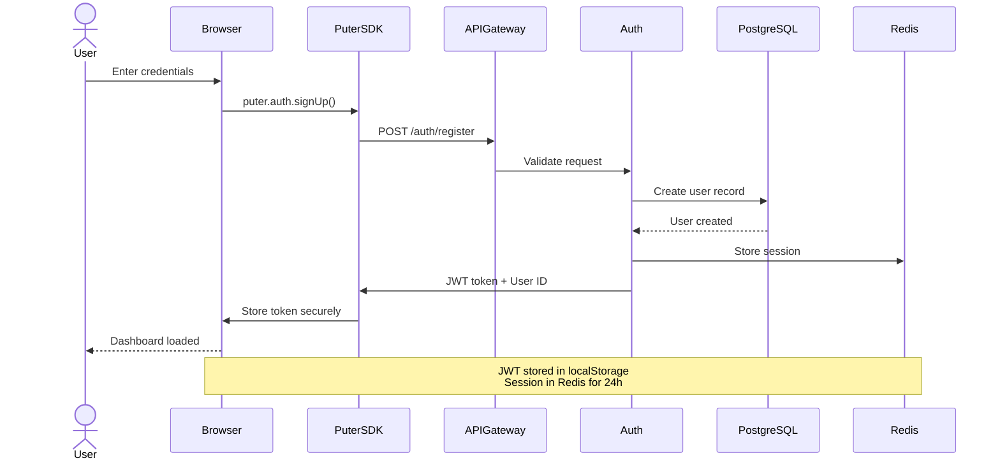
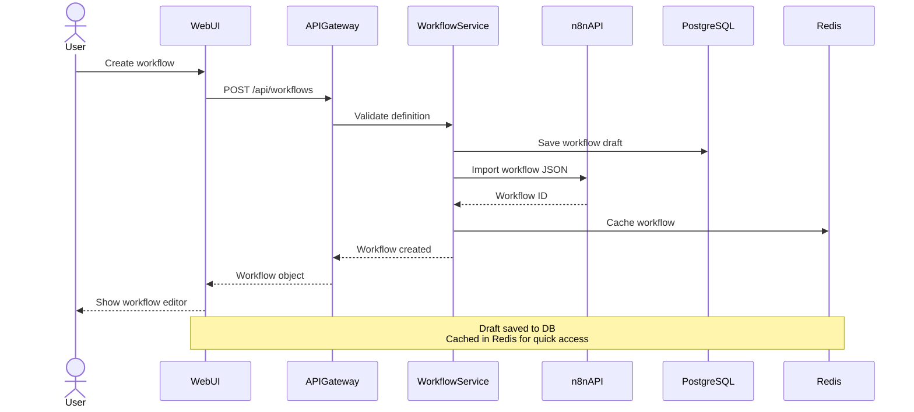
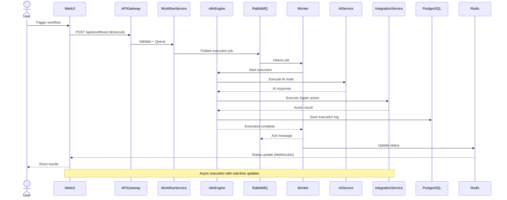
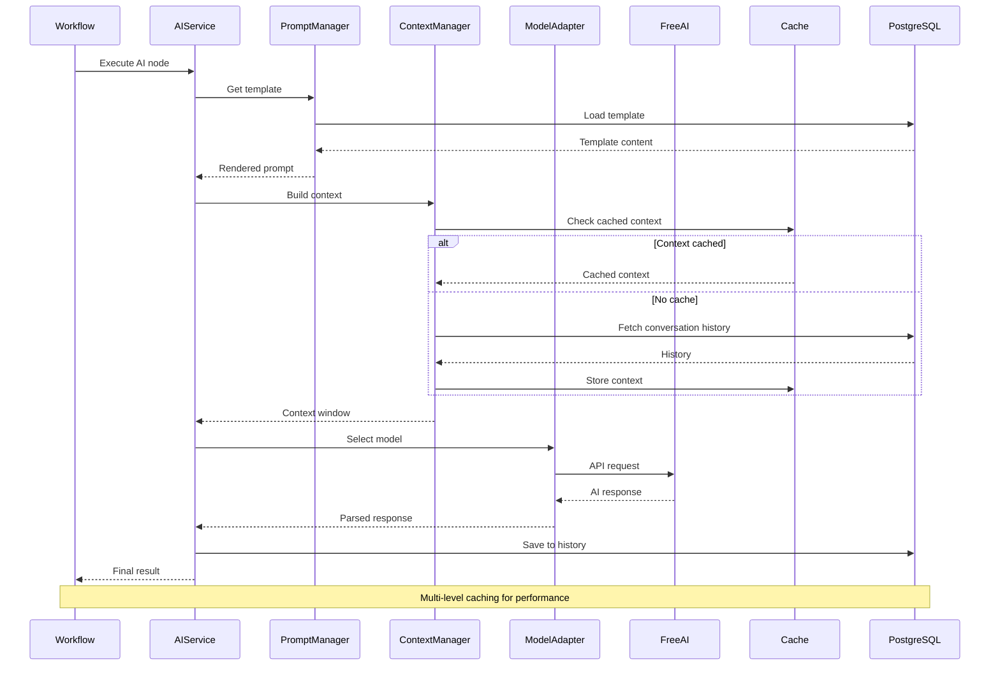
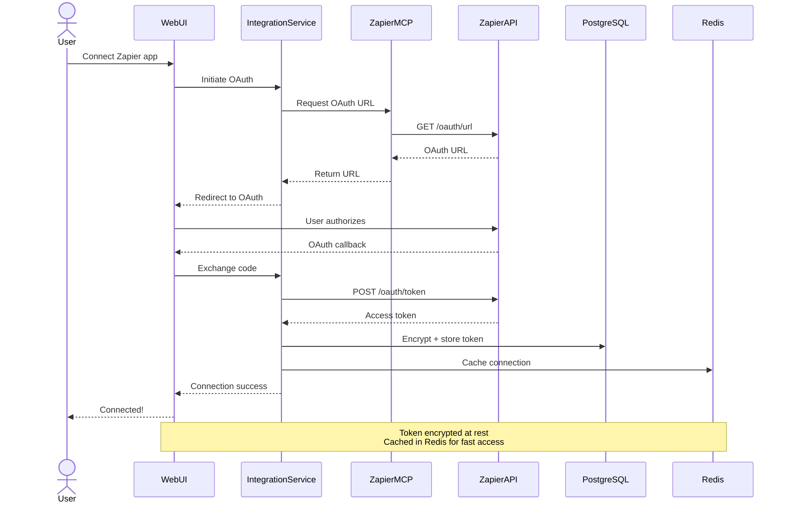
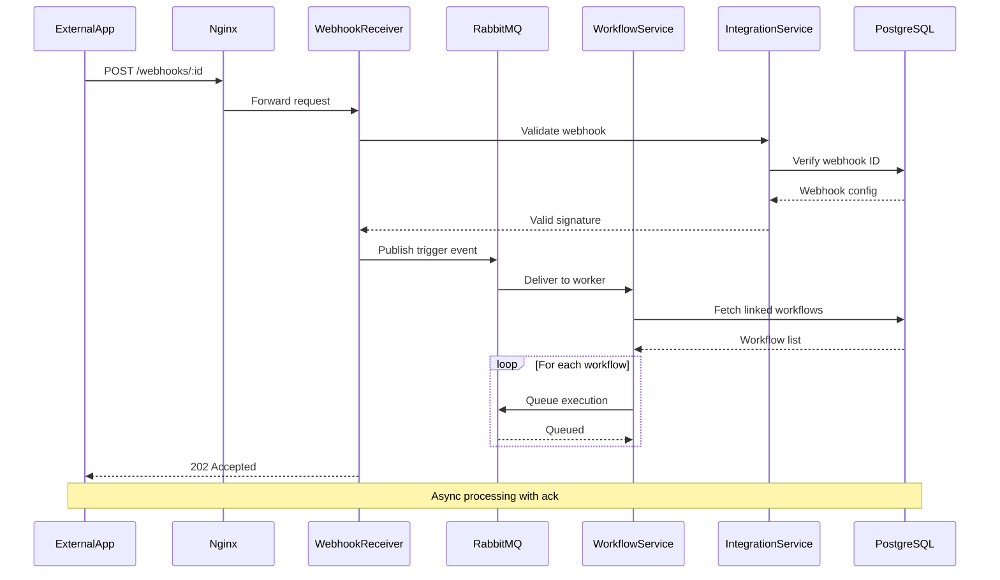

# Component Interaction Diagrams

## Overview

This document describes how components interact within the Jobsprint platform, including communication protocols, data flows, and integration patterns.

## Interaction Patterns

### Synchronous Communication
- **Protocol**: HTTP/1.1 and HTTP/2
- **Format**: JSON for APIs, WebSocket for real-time
- **Pattern**: Request/Response with RESTful semantics
- **Timeout**: 30s default, configurable per endpoint

### Asynchronous Communication
- **Protocol**: AMQP over RabbitMQ
- **Pattern**: Publisher/Subscriber with competing consumers
- **Message Format**: JSON with envelope metadata
- **Delivery**: At-least-once with idempotent handlers

### Event-Driven Communication
- **Protocol**: Redis Pub/Sub
- **Pattern**: Broadcast to multiple subscribers
- **Use Cases**: Cache invalidation, real-time updates
- **Message Format**: Lightweight JSON events

## Sequence Diagrams

### 1. User Authentication Flow



### 2. Workflow Creation Flow



### 3. Workflow Execution Flow



### 4. AI Model Request Flow



### 5. Zapier Integration Connection Flow



### 6. Webhook Reception Flow



## Component Communication Matrix

| From | To | Protocol | Purpose | Sync/Async |
|------|-----|----------|---------|------------|
| Browser | API Gateway | HTTPS | API requests | Sync |
| Browser | Puter.js | HTTPS | Auth + Storage | Sync |
| API Gateway | Workflow Service | HTTP | Workflow CRUD | Sync |
| API Gateway | AI Service | HTTP | AI requests | Sync |
| API Gateway | Integration Service | HTTP | Integration CRUD | Sync |
| Workflow Service | n8n | HTTP | Execution | Sync |
| Workflow Service | RabbitMQ | AMQP | Job queue | Async |
| AI Service | Free AI | HTTPS | Model inference | Sync |
| Integration Service | Zapier | HTTPS | App actions | Sync |
| Webhook Receiver | RabbitMQ | AMQP | Trigger events | Async |
| All Services | PostgreSQL | TCP | Data persistence | Sync |
| All Services | Redis | TCP | Cache/sessions | Sync |
| All Services | RabbitMQ | AMQP | Events | Async |
| Browser | Redis | WebSocket | Real-time updates | Async |

## Service Contracts

### API Gateway Contract
```yaml
# OpenAPI 3.0 specification snippet
paths:
  /api/workflows:
    post:
      summary: Create workflow
      requestBody:
        content:
          application/json:
            schema:
              $ref: '#/components/schemas/WorkflowCreate'
      responses:
        '201':
          description: Workflow created
          content:
            application/json:
              schema:
                $ref: '#/components/schemas/Workflow'
        '400':
          description: Validation error
        '401':
          description: Unauthorized
```

### Message Queue Contract
```json
{
  "messageId": "uuid",
  "timestamp": "2024-01-06T00:00:00Z",
  "type": "workflow.execute",
  "version": "1.0",
  "payload": {
    "workflowId": "uuid",
    "executionId": "uuid",
    "input": {},
    "trigger": "manual"
  },
  "metadata": {
    "priority": "normal",
    "retryCount": 0,
    "timeout": 300000
  }
}
```

### Event Bus Contract
```json
{
  "eventId": "uuid",
  "timestamp": "2024-01-06T00:00:00Z",
  "eventType": "workflow.completed",
  "aggregateId": "workflow-id",
  "data": {
    "workflowId": "uuid",
    "executionId": "uuid",
    "status": "success",
    "duration": 5000
  }
}
```

## Error Handling & Recovery

### Retry Strategy
1. **Transient Errors** (5xx, network timeouts)
   - Exponential backoff: 1s, 2s, 4s, 8s, 16s
   - Max retries: 5 attempts
   - Dead letter queue after max retries

2. **Permanent Errors** (4xx, validation)
   - No retry
   - Log error details
   - Notify user

3. **Circuit Breaker**
   - Open after 5 consecutive failures
   - Half-open after 60 seconds
   - Close after 3 successful requests

### Fallback Strategy
1. **AI Model Fallback**
   - Primary: Free GPT-3.5-turbo
   - Fallback: Code-Davinci
   - Last resort: Queued for retry

2. **Integration Fallback**
   - Primary: Zapier API
   - Fallback: Direct API (if available)
   - Last resort: Manual notification

## Monitoring & Observability

### Metrics Collection
- **Request metrics**: Latency, throughput, error rate
- **Workflow metrics**: Execution time, success rate, node performance
- **AI metrics**: Token usage, response time, model accuracy
- **Integration metrics**: API call count, quota usage, failures

### Distributed Tracing
- **Trace ID**: Generated at API gateway
- **Span propagation**: Across all service boundaries
- **Sampling**: 100% for errors, 10% for normal

### Logging Strategy
- **Structured logging**: JSON format
- **Log levels**: ERROR, WARN, INFO, DEBUG
- **Log aggregation**: Centralized in PostgreSQL + Elasticsearch
- **Retention**: 30 days hot, 1 year cold

## Next Architecture Documents
- [Data Flow Diagrams](./04-data-flow.md)
- [Database Design](./05-database-design.md)
- [API Design](./06-api-design.md)
