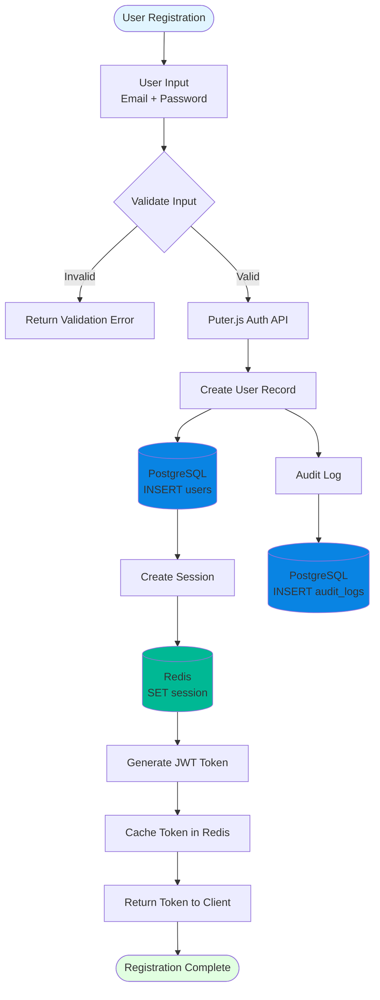
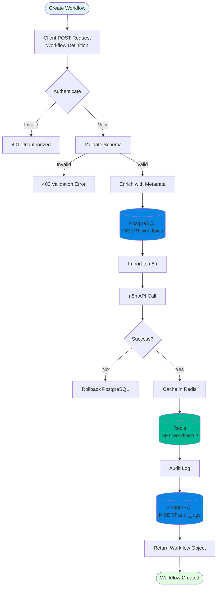
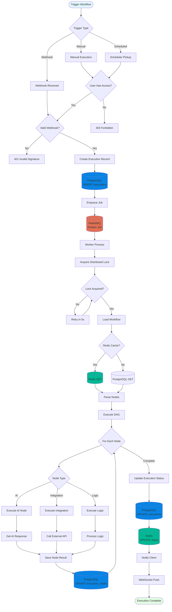
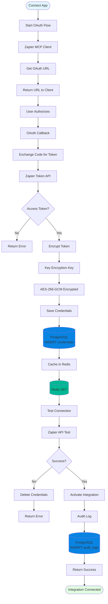
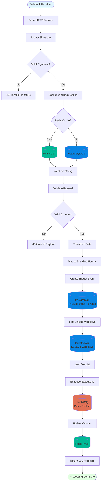

# Data Flow Diagrams

## Overview

This document describes how data flows through the Jobsprint platform, including request flows, data transformations, and persistence patterns.

## Data Flow Principles

### 1. Unidirectional Data Flow
- **Request Flow**: Client → API Gateway → Service → Data Layer → External Service
- **Response Flow**: External Service → Data Layer → Service → API Gateway → Client
- **Event Flow**: Service → Message Queue → Worker Service → Data Layer

### 2. Data Transformation Layers
- **API Layer**: Request validation, authentication, rate limiting
- **Service Layer**: Business logic, data aggregation, transformation
- **Data Layer**: Persistence, caching, retrieval
- **Integration Layer**: External API calls, data mapping

### 3. Data Consistency
- **Strong Consistency**: PostgreSQL transactions for critical data
- **Eventual Consistency**: Redis cache with TTL invalidation
- **Best Effort**: Message queue with at-least-once delivery

## Primary Data Flows

### 1. User Registration & Authentication Data Flow



**Data Transformations:**
1. **Password**: Hashed with bcrypt (10 rounds) before storage
2. **Email**: Lowercased and trimmed
3. **User ID**: UUID v4 generated
4. **Token**: JWT with 24-hour expiration
5. **Session**: Redis key format `session:{userId}` with 24h TTL

### 2. Workflow Creation Data Flow



**Data Transformations:**
1. **Workflow ID**: UUID v4
2. **Nodes**: Validated against node registry schema
3. **Connections**: DAG validation (no cycles)
4. **Credentials**: Encrypted with AES-256-GCM
5. **Metadata**: Auto-populate (created_at, updated_at, version)

### 3. Workflow Execution Data Flow



**Data Transformations:**
1. **Execution ID**: UUID v4
2. **Input Data**: JSON schema validation
3. **Node Output**: Serialized to JSON, max 10MB per node
4. **Error Handling**: Stack traces sanitized before storage
5. **Status Updates**: Published to Redis Pub/Sub

### 4. AI Request/Response Data Flow

```mermaid
flowchart TD
    Start([AI Node Execution]) --> GetTemplate[Get Prompt Template]
    GetTemplate --> TemplateCache{Redis Cache?}
    TemplateCache -->|Yes| CacheGet[(Redis GET)]
    TemplateCache -->|No| DBGet[(PostgreSQL GET)]
    CacheGet --> Render[Render Template]
    DBGet --> Render

    Render --> GetContext[Get Conversation Context]
    GetContext --> ContextCache{Redis Cache?}
    ContextCache -->|Yes| ContextGet[(Redis GET)]
    ContextCache -->|No| ContextDB[(PostgreSQL GET)]
    ContextGet --> TokenCount[Count Tokens]
    ContextDB --> TokenCount

    TokenCount --> WindowCheck{Within Window?}
    WindowCheck -->|No| Truncate[Truncate History]
    WindowCheck -->|Yes| BuildRequest[Build AI Request]
    Truncate --> BuildRequest

    BuildRequest --> ModelSelect[Select Model]
    ModelSelect --> RateCheck{Rate Limit?}
    RateCheck -->|Yes| Error[Return 429 Error]
    RateCheck -->|No| APIRequest[Call Free AI API]

    APIRequest --> AICall[Free AI Endpoint]
    AICall --> AIResponse{Response?}
    AIResponse -->|Error| Retry{Retry Count < 3?}
    AIResponse -->|Success| ParseResponse[Parse Response]

    Retry -->|Yes| APIRequest
    Retry -->|No| Fallback[Fallback Model]

    Fallback --> FallbackCall[Call Fallback Model]
    FallbackCall --> ParseResponse

    ParseResponse --> Validate{Valid Response?}
    Validate -->|No| Error2[Return 500 Error]
    Validate -->|Yes| SaveHistory[Save to History]
    SaveHistory --> PGWrite[(PostgreSQL<br/>INSERT ai_history)]
    PGWrite --> CacheResult[Cache Result]
    CacheResult --> RedisSet[(Redis SET)]
    RedisSet --> End([Return AI Response])

    style Start fill:#e1f5ff
    style End fill:#e1ffe1
    style CacheGet fill:#00b894
    style ContextGet fill:#00b894
    style RedisSet fill:#00b894
    style DBGet fill:#0984e3
    style PGWrite fill:#0984e3
```



**Data Transformations:**
1. **Template**: Handlebars rendering with variables
2. **Context**: Last N messages within token limit (4096 tokens)
3. **Request**: JSON with model, messages, temperature, max_tokens
4. **Response**: Parse JSON, extract text, metadata
5. **History**: Store user message + AI response pair

### 5. Integration Connection Data Flow



**Data Transformations:**
1. **OAuth State**: Random UUID for CSRF protection
2. **Access Token**: Encrypted with app-specific key
3. **Refresh Token**: Encrypted separately
4. **Credentials**: Stored as JSON blob in PostgreSQL
5. **Cache**: Key format `integration:{userId}:{appId}`

### 6. Webhook Processing Data Flow



**Data Transformations:**
1. **Signature**: HMAC-SHA256 validation
2. **Payload**: JSON schema validation against app schema
3. **Event ID**: UUID v4
4. **Data Mapping**: Transform to standard internal format
5. **Batching**: RabbitMQ batch publish for efficiency

## Data Flow Patterns

### 1. Request Validation Pattern
```
Client Request → Schema Validation → Auth Check → Rate Limit → Business Logic
```

### 2. Cache-Aside Pattern
```
Request → Check Cache → Cache Hit? → Return
                              → Cache Miss → Load from DB → Update Cache → Return
```

### 3. Write-Through Pattern
```
Write Request → Validate → Write to DB → Update Cache → Return
```

### 4. Event Sourcing Pattern
```
State Change → Save State → Emit Event → Event Handlers → Update Read Models
```

### 5. CQRS Pattern
```
Command (Write) → Validate → Write DB → Emit Event
Query (Read) → Check Cache → Load from Read DB → Return
```

## Data Integrity & Consistency

### Transaction Boundaries
1. **User Operations**: Single transaction across user + session
2. **Workflow Creation**: Transaction across workflow + n8n + audit
3. **Workflow Execution**: Transaction per node, eventual consistency
4. **AI Requests**: Transaction for history, cache async

### Idempotency Keys
- Format: `{userId}:{resourceType}:{resourceId}:{action}`
- TTL: 24 hours
- Storage: Redis with SETNX

### Distributed Locks
- Purpose: Prevent concurrent execution of same workflow
- Implementation: Redis RedLock algorithm
- TTL: 5 minutes (auto-release)

## Data Retention & Cleanup

### Retention Policies
1. **Audit Logs**: 1 year (compliance)
2. **Executions**: 90 days (performance)
3. **AI History**: 30 days (cost)
4. **Cache**: Variable TTL (5min - 24h)

### Cleanup Jobs
1. **Daily**: Soft-delete old records
2. **Weekly**: Vacuum PostgreSQL
3. **Monthly**: Hard-delete soft-deleted records

## Next Architecture Documents
- [Database Design](./05-database-design.md)
- [API Design](./06-api-design.md)
- [Security Architecture](./07-security-architecture.md)
