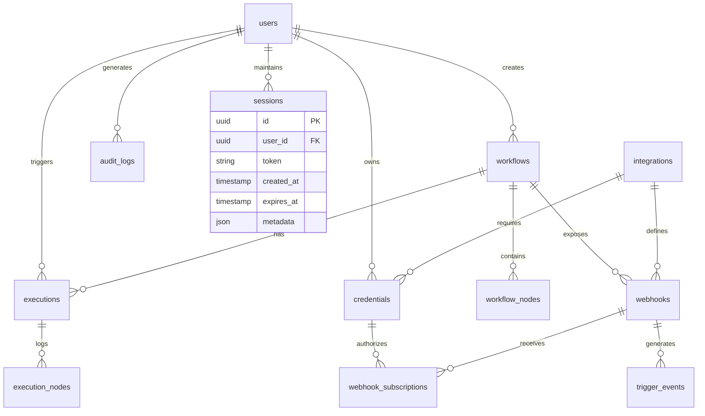

# Database Design

## Overview

Jobsprint uses a polyglot persistence strategy with PostgreSQL as the primary data store, Redis for caching and sessions, and RabbitMQ for message queuing.

## Database Technologies

| Database | Purpose | Data Model | Scale |
|----------|---------|------------|-------|
| PostgreSQL 15+ | Primary data store | Relational | 1 primary + 2 replicas |
| Redis 7+ | Cache, sessions, pub/sub | Key-value | 3 node cluster |
| RabbitMQ 3.12+ | Message queue | Message broker | 3 node cluster |
| Puter.js Cloud | User files, AI artifacts | Object storage | Cloud |

## PostgreSQL Schema Design

### Entity Relationship Diagram



### Table Definitions

#### 1. Users Table

```sql
CREATE TABLE users (
    id UUID PRIMARY KEY DEFAULT gen_random_uuid(),
    email VARCHAR(255) UNIQUE NOT NULL,
    username VARCHAR(100) UNIQUE NOT NULL,
    password_hash VARCHAR(255) NOT NULL,
    full_name VARCHAR(255),
    avatar_url TEXT,

    -- Account status
    is_active BOOLEAN DEFAULT true,
    is_verified BOOLEAN DEFAULT false,
    role VARCHAR(50) DEFAULT 'user', -- 'admin', 'user'

    -- Timestamps
    created_at TIMESTAMPTZ DEFAULT NOW(),
    updated_at TIMESTAMPTZ DEFAULT NOW(),
    last_login_at TIMESTAMPTZ,

    -- Settings (JSONB for flexibility)
    settings JSONB DEFAULT '{}',

    -- Metadata
    metadata JSONB DEFAULT '{}',

    -- Indexes
    CONSTRAINT email_format CHECK (email ~* '^[A-Za-z0-9._%+-]+@[A-Za-z0-9.-]+\.[A-Za-z]{2,}$')
);

-- Indexes for performance
CREATE INDEX idx_users_email ON users(email);
CREATE INDEX idx_users_username ON users(username);
CREATE INDEX idx_users_is_active ON users(is_active);
CREATE INDEX idx_users_created_at ON users(created_at);

-- GIN index for JSONB queries
CREATE INDEX idx_users_settings ON users USING GIN(settings);
CREATE INDEX idx_users_metadata ON users USING GIN(metadata);

-- Comments
COMMENT ON TABLE users IS 'User accounts and authentication data';
COMMENT ON COLUMN users.settings IS 'User preferences and settings (JSONB)';
COMMENT ON COLUMN users.metadata IS 'Extensible metadata field';
```

**Sample Data:**
```json
{
  "id": "550e8400-e29b-41d4-a716-446655440000",
  "email": "user@example.com",
  "username": "johndoe",
  "password_hash": "$2b$10$xyz...",
  "full_name": "John Doe",
  "role": "user",
  "is_active": true,
  "is_verified": true,
  "created_at": "2024-01-06T00:00:00Z",
  "settings": {
    "theme": "dark",
    "notifications": true,
    "timezone": "America/New_York"
  }
}
```

#### 2. Workflows Table

```sql
CREATE TABLE workflows (
    id UUID PRIMARY KEY DEFAULT gen_random_uuid(),
    user_id UUID NOT NULL REFERENCES users(id) ON DELETE CASCADE,
    name VARCHAR(255) NOT NULL,
    description TEXT,

    -- Workflow definition
    definition JSONB NOT NULL, -- n8n workflow JSON
    version INTEGER DEFAULT 1,
    is_active BOOLEAN DEFAULT true,

    -- Workflow metadata
    category VARCHAR(100),
    tags TEXT[] DEFAULT '{}',
    icon_url TEXT,

    -- Execution stats
    total_executions BIGINT DEFAULT 0,
    successful_executions BIGINT DEFAULT 0,
    failed_executions BIGINT DEFAULT 0,
    last_execution_at TIMESTAMPTZ,

    -- Timestamps
    created_at TIMESTAMPTZ DEFAULT NOW(),
    updated_at TIMESTAMPTZ DEFAULT NOW(),

    -- Settings
    settings JSONB DEFAULT '{}',

    -- Indexes
    CONSTRAINT valid_definition CHECK (definition ? 'nodes')
);

CREATE INDEX idx_workflows_user_id ON workflows(user_id);
CREATE INDEX idx_workflows_is_active ON workflows(is_active);
CREATE INDEX idx_workflows_category ON workflows(category);
CREATE INDEX idx_workflows_tags ON workflows USING GIN(tags);
CREATE INDEX idx_workflows_created_at ON workflows(created_at);

-- GIN index for workflow definition queries
CREATE INDEX idx_workflows_definition ON workflows USING GIN(definition);

-- Full-text search
CREATE INDEX idx_workflows_name_search ON workflows USING GIN(to_tsvector('english', name));
CREATE INDEX idx_workflows_description_search ON workflows USING GIN(to_tsvector('english', description));

COMMENT ON TABLE workflows IS 'Workflow definitions and metadata';
COMMENT ON COLUMN workflows.definition IS 'n8n-compatible workflow JSON';
```

**Sample Data:**
```json
{
  "id": "660e8400-e29b-41d4-a716-446655440000",
  "user_id": "550e8400-e29b-41d4-a716-446655440000",
  "name": "Email Auto-Responder",
  "description": "Automatically respond to incoming emails",
  "definition": {
    "nodes": [
      {
        "id": "node-1",
        "type": "trigger",
        "name": "Email Trigger",
        "config": {...}
      },
      {
        "id": "node-2",
        "type": "ai",
        "name": "AI Response",
        "config": {...}
      }
    ],
    "connections": [...]
  },
  "version": 1,
  "is_active": true,
  "category": "automation",
  "tags": ["email", "ai", "automation"],
  "total_executions": 150,
  "successful_executions": 142,
  "failed_executions": 8
}
```

#### 3. Integrations Table

```sql
CREATE TABLE integrations (
    id UUID PRIMARY KEY DEFAULT gen_random_uuid(),
    user_id UUID NOT NULL REFERENCES users(id) ON DELETE CASCADE,

    -- Integration details
    app_id VARCHAR(100) NOT NULL, -- Zapier app ID
    app_name VARCHAR(255) NOT NULL,
    app_type VARCHAR(50) NOT NULL, -- 'zapier', 'custom', 'n8n'

    -- Connection status
    is_active BOOLEAN DEFAULT true,
    is_connected BOOLEAN DEFAULT false,
    last_verified_at TIMESTAMPTZ,

    -- Capabilities
    capabilities JSONB DEFAULT '{}', -- triggers, actions, webhooks

    -- Timestamps
    created_at TIMESTAMPTZ DEFAULT NOW(),
    updated_at TIMESTAMPTZ DEFAULT NOW(),

    -- Settings
    settings JSONB DEFAULT '{}',

    UNIQUE(user_id, app_id)
);

CREATE INDEX idx_integrations_user_id ON integrations(user_id);
CREATE INDEX idx_integrations_app_id ON integrations(app_id);
CREATE INDEX idx_integrations_is_active ON integrations(is_active);
CREATE INDEX idx_integrations_app_type ON integrations(app_type);

COMMENT ON TABLE integrations IS 'Third-party app integrations';
COMMENT ON COLUMN integrations.capabilities IS 'Available triggers and actions (JSONB)';
```

#### 4. Credentials Table

```sql
CREATE TABLE credentials (
    id UUID PRIMARY KEY DEFAULT gen_random_uuid(),
    user_id UUID NOT NULL REFERENCES users(id) ON DELETE CASCADE,
    integration_id UUID REFERENCES integrations(id) ON DELETE CASCADE,
    name VARCHAR(255) NOT NULL,

    -- Encrypted credentials
    encrypted_data BYTEA NOT NULL, -- AES-256-GCM encrypted
    key_id VARCHAR(100), -- Key encryption key identifier

    -- OAuth specific
    oauth_access_token TEXT,
    oauth_refresh_token TEXT,
    oauth_expires_at TIMESTAMPTZ,

    -- Credential metadata
    type VARCHAR(50) NOT NULL, -- 'oauth2', 'api_key', 'basic_auth'
    is_active BOOLEAN DEFAULT true,

    -- Timestamps
    created_at TIMESTAMPTZ DEFAULT NOW(),
    updated_at TIMESTAMPTZ DEFAULT NOW(),
    last_used_at TIMESTAMPTZ
);

CREATE INDEX idx_credentials_user_id ON credentials(user_id);
CREATE INDEX idx_credentials_integration_id ON credentials(integration_id);
CREATE INDEX idx_credentials_type ON credentials(type);
CREATE INDEX idx_credentials_is_active ON credentials(is_active);

COMMENT ON TABLE credentials IS 'Encrypted third-party credentials';
COMMENT ON COLUMN credentials.encrypted_data IS 'AES-256-GCM encrypted credential data';
```

#### 5. Executions Table

```sql
CREATE TABLE executions (
    id UUID PRIMARY KEY DEFAULT gen_random_uuid(),
    workflow_id UUID NOT NULL REFERENCES workflows(id) ON DELETE CASCADE,
    user_id UUID NOT NULL REFERENCES users(id) ON DELETE CASCADE,

    -- Execution metadata
    status VARCHAR(50) NOT NULL, -- 'pending', 'running', 'success', 'failed', 'cancelled'
    trigger_type VARCHAR(50) NOT NULL, -- 'manual', 'scheduled', 'webhook', 'api'

    -- Input/Output
    input_data JSONB,
    output_data JSONB,
    error_message TEXT,

    -- Performance metrics
    started_at TIMESTAMPTZ DEFAULT NOW(),
    completed_at TIMESTAMPTZ,
    duration_ms INTEGER,

    -- Execution context
    execution_metadata JSONB DEFAULT '{}',

    -- Retry info
    retry_count INTEGER DEFAULT 0,
    max_retries INTEGER DEFAULT 3,

    -- Indexes
    CONSTRAINT valid_status CHECK (status IN ('pending', 'running', 'success', 'failed', 'cancelled'))
);

CREATE INDEX idx_executions_workflow_id ON executions(workflow_id);
CREATE INDEX idx_executions_user_id ON executions(user_id);
CREATE INDEX idx_executions_status ON executions(status);
CREATE INDEX idx_executions_started_at ON executions(started_at DESC);
CREATE INDEX idx_executions_trigger_type ON executions(trigger_type);

-- Composite index for common queries
CREATE INDEX idx_executions_workflow_status ON executions(workflow_id, status, started_at DESC);

COMMENT ON TABLE executions IS 'Workflow execution records';
```

#### 6. Audit Logs Table

```sql
CREATE TABLE audit_logs (
    id UUID PRIMARY KEY DEFAULT gen_random_uuid(),
    user_id UUID REFERENCES users(id) ON DELETE SET NULL,

    -- Event details
    event_type VARCHAR(100) NOT NULL, -- 'workflow.created', 'user.login', etc.
    resource_type VARCHAR(100) NOT NULL, -- 'workflow', 'user', 'integration'
    resource_id UUID,

    -- Event data
    action VARCHAR(50) NOT NULL, -- 'create', 'read', 'update', 'delete'
    changes JSONB, -- before/after values
    metadata JSONB DEFAULT '{}',

    -- Request context
    ip_address INET,
    user_agent TEXT,
    request_id UUID,

    -- Timestamp
    created_at TIMESTAMPTZ DEFAULT NOW()
);

CREATE INDEX idx_audit_logs_user_id ON audit_logs(user_id);
CREATE INDEX idx_audit_logs_event_type ON audit_logs(event_type);
CREATE INDEX idx_audit_logs_resource_type ON audit_logs(resource_type);
CREATE INDEX idx_audit_logs_resource_id ON audit_logs(resource_id);
CREATE INDEX idx_audit_logs_created_at ON audit_logs(created_at DESC);

-- Composite index for filtering
CREATE INDEX idx_audit_logs_user_type ON audit_logs(user_id, resource_type, created_at DESC);

-- Partitioning by month for performance (PostgreSQL 15+)
CREATE TABLE audit_logs_y2024m01 PARTITION OF audit_logs
    FOR VALUES FROM ('2024-01-01') TO ('2024-02-01');

COMMENT ON TABLE audit_logs IS 'Audit trail for compliance and debugging';
```

#### 7. Sessions Table

```sql
CREATE TABLE sessions (
    id UUID PRIMARY KEY DEFAULT gen_random_uuid(),
    user_id UUID NOT NULL REFERENCES users(id) ON DELETE CASCADE,

    -- Session data
    token_hash VARCHAR(255) UNIQUE NOT NULL,
    session_data JSONB DEFAULT '{}',

    -- Device info
    device_type VARCHAR(50),
    device_name VARCHAR(255),
    ip_address INET,

    -- Timestamps
    created_at TIMESTAMPTZ DEFAULT NOW(),
    expires_at TIMESTAMPTZ NOT NULL,
    last_activity_at TIMESTAMPTZ DEFAULT NOW(),

    -- Status
    is_active BOOLEAN DEFAULT true
);

CREATE INDEX idx_sessions_user_id ON sessions(user_id);
CREATE INDEX idx_sessions_token_hash ON sessions(token_hash);
CREATE INDEX idx_sessions_expires_at ON sessions(expires_at);
CREATE INDEX idx_sessions_is_active ON sessions(is_active);

-- Auto-cleanup expired sessions
CREATE INDEX idx_sessions_cleanup ON sessions(expires_at) WHERE is_active = true;

COMMENT ON TABLE sessions IS 'User session management';
```

#### 8. Workflow Nodes Table (Optional - for detailed tracking)

```sql
CREATE TABLE workflow_nodes (
    id UUID PRIMARY KEY DEFAULT gen_random_uuid(),
    workflow_id UUID NOT NULL REFERENCES workflows(id) ON DELETE CASCADE,
    node_id VARCHAR(100) NOT NULL, -- ID from workflow definition
    node_type VARCHAR(100) NOT NULL,
    node_name VARCHAR(255) NOT NULL,

    -- Node configuration
    config JSONB DEFAULT '{}',

    -- Position in workflow
    position INTEGER,

    UNIQUE(workflow_id, node_id)
);

CREATE INDEX idx_workflow_nodes_workflow_id ON workflow_nodes(workflow_id);
CREATE INDEX idx_workflow_nodes_node_type ON workflow_nodes(node_type);

COMMENT ON TABLE workflow_nodes IS 'Workflow node definitions';
```

#### 9. Execution Nodes Table

```sql
CREATE TABLE execution_nodes (
    id UUID PRIMARY KEY DEFAULT gen_random_uuid(),
    execution_id UUID NOT NULL REFERENCES executions(id) ON DELETE CASCADE,
    node_id VARCHAR(100) NOT NULL,
    node_name VARCHAR(255) NOT NULL,
    node_type VARCHAR(100) NOT NULL,

    -- Execution details
    status VARCHAR(50) NOT NULL,
    started_at TIMESTAMPTZ,
    completed_at TIMESTAMPTZ,
    duration_ms INTEGER,

    -- Input/Output
    input_data JSONB,
    output_data JSONB,
    error_message TEXT,

    -- Retry info
    retry_count INTEGER DEFAULT 0,

    UNIQUE(execution_id, node_id)
);

CREATE INDEX idx_execution_nodes_execution_id ON execution_nodes(execution_id);
CREATE INDEX idx_execution_nodes_status ON execution_nodes(status);
CREATE INDEX idx_execution_nodes_node_type ON execution_nodes(node_type);

COMMENT ON TABLE execution_nodes IS 'Per-node execution logs';
```

## Redis Data Structures

### Key Naming Convention
```
{namespace}:{entity_type}:{entity_id}:{attribute}
```

### Common Keys

#### Session Keys
```
Format: session:{session_id}
TTL: 24 hours
Type: Hash
Fields:
  - user_id: UUID
  - created_at: ISO timestamp
  - last_activity: ISO timestamp
  - device_info: JSON
```

#### Cache Keys
```
Format: cache:{entity_type}:{entity_id}
TTL: 1 hour (configurable)
Type: String (JSON)
```

#### Rate Limiting
```
Format: ratelimit:{user_id}:{endpoint}
TTL: 60 seconds (sliding window)
Type: String (counter)
```

#### Distributed Locks
```
Format: lock:{resource_type}:{resource_id}
TTL: 5 minutes (auto-release)
Type: String
```

#### Pub/Sub Channels
```
Format: channel:{resource_type}:{event}
Examples:
  - channel:workflow:execution_updated
  - channel:user:notification
```

## Migration Strategy

### Version Control
- Tool: dbmate or similar
- Location: `/src/backend/migrations/`
- Format: SQL files with timestamps

### Rollback Strategy
- All migrations must be reversible
- Use transactions for schema changes
- Test migrations on staging first

## Data Backup & Recovery

### Backup Strategy
1. **Daily Full Backups**: pg_dump at 2 AM UTC
2. **Continuous WAL Archiving**: Point-in-time recovery
3. **Weekly Backups**: 30-day retention
4. **Cross-region Replication**: Disaster recovery

### Recovery Procedures
1. **Point-in-Time Recovery**: WAL replay
2. **Full Restore**: From backup + WAL
3. **Single Table Restore**: pg_restore with selective tables

## Next Architecture Documents
- [API Design](./06-api-design.md)
- [Security Architecture](./07-security-architecture.md)
- [Deployment Architecture](./08-deployment-architecture.md)
