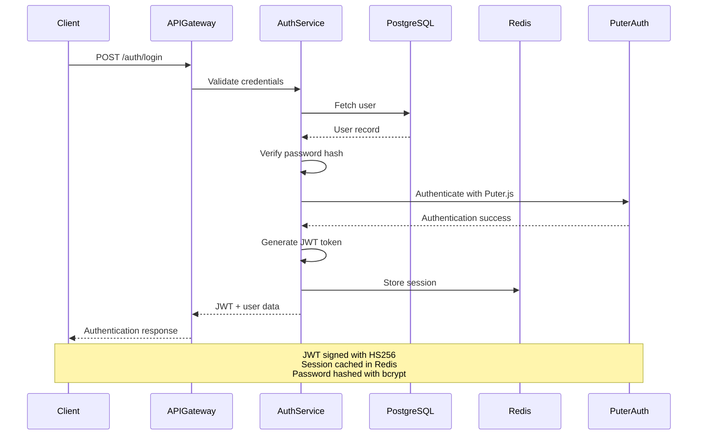

# Security Architecture

## Overview

Jobsprint implements defense-in-depth security with multiple layers of protection, following OWASP and NIST guidelines.

## Security Principles

1. **Zero Trust**: Verify explicitly, never trust implicitly
2. **Least Privilege**: Minimum required access only
3. **Defense in Depth**: Multiple security layers
4. **Security by Design**: Built-in from the start
5. **Compliance**: GDPR, SOC 2, HIPAA capable

## Authentication & Authorization

### Authentication Flow



### JWT Token Security

#### Token Structure
```json
{
  "header": {
    "alg": "HS256",
    "typ": "JWT",
    "kid": "key-2024-01"
  },
  "payload": {
    "user_id": "uuid",
    "email": "user@example.com",
    "role": "user",
    "permissions": ["workflow:create", "workflow:execute"],
    "iat": 1704508800,
    "exp": 1704595200,
    "iss": "jobsprint.io",
    "aud": "jobsprint-api"
  }
}
```

#### Token Management
- **Secret Key**: 256-bit key from environment variable
- **Algorithm**: HS256 (HMAC-SHA256)
- **Expiration**: 24 hours (refreshable)
- **Storage**: HttpOnly cookie or localStorage (configurable)
- **Rotation**: Key rotation every 90 days

### Role-Based Access Control (RBAC)

#### Roles
1. **Admin**: Full system access
2. **User**: Standard user access
3. **Viewer**: Read-only access

#### Permissions Matrix

| Resource | Admin | User | Viewer |
|----------|-------|------|--------|
| Users (CRUD) | ✅ | ❌ | ❌ |
| Own Workflows | ✅ | ✅ | ❌ |
| All Workflows | ✅ | ❌ | ❌ |
| Executions | ✅ | ✅ | ❌ |
| Integrations | ✅ | ✅ | ❌ |
| Admin APIs | ✅ | ❌ | ❌ |

#### Permission Check Flow
```javascript
// Pseudo-code for permission check
function checkPermission(userId, resource, action) {
  const user = await getUser(userId);
  const role = user.role;

  if (rolePermissions[role][resource]?.includes(action)) {
    return true;
  }

  // Check custom permissions
  if (user.permissions?.includes(`${resource}:${action}`)) {
    return true;
  }

  return false;
}
```

## Data Protection

### Encryption at Rest

#### PostgreSQL Encryption
- **Database**: Transparent Data Encryption (TDE)
- **Backups**: Encrypted with AES-256
- **Key Management**: AWS KMS or HashiCorp Vault

#### Credential Encryption
```javascript
// Encrypt credentials before storage
const crypto = require('crypto');

function encryptCredentials(data, keyId) {
  const key = await getKeyFromVault(keyId);
  const iv = crypto.randomBytes(16);
  const cipher = crypto.createCipheriv('aes-256-gcm', key, iv);

  let encrypted = cipher.update(JSON.stringify(data), 'utf8', 'hex');
  encrypted += cipher.final('hex');
  const authTag = cipher.getAuthTag();

  return {
    encrypted_data: Buffer.from(encrypted + authTag),
    iv: iv,
    key_id: keyId
  };
}
```

### Encryption in Transit

#### TLS Configuration
- **Version**: TLS 1.3 minimum
- **Ciphers**: ECDHE-RSA-AES256-GCM-SHA384
- **Certificates**: Let's Encrypt (auto-renewal)
- **HSTS**: Enabled with max-age=31536000
- **Perfect Forward Secrecy**: Enabled

#### Internal Communication
- **Service-to-Service**: mTLS (mutual TLS)
- **Database**: SSL/TLS required
- **Redis**: TLS enabled
- **RabbitMQ**: TLS enabled

## Input Validation & Sanitization

### Request Validation
```javascript
// Validation middleware
const { body, validationResult } = require('express-validator');

app.post('/api/v1/workflows',
  [
    body('name')
      .trim()
      .isLength({ min: 1, max: 255 })
      .escape(),
    body('definition')
      .isObject()
      .custom(isValidWorkflowDefinition),
    body('tags')
      .optional()
      .isArray()
      .custom(tags => tags.every(tag => typeof tag === 'string'))
  ],
  (req, res) => {
    const errors = validationResult(req);
    if (!errors.isEmpty()) {
      return res.status(400).json({ errors: errors.array() });
    }
    // Process request
  }
);
```

### SQL Injection Prevention
- **ORM**: Use parameterized queries (TypeORM)
- **Input Validation**: Validate all user input
- **Least Privilege**: Database user with limited permissions
- **Query Auditing**: Log all queries for review

### XSS Prevention
- **Output Encoding**: Encode all dynamic content
- **Content Security Policy**: Strict CSP headers
- **Sanitization**: DOMPurify for HTML content
- **HttpOnly Cookies**: Prevent JavaScript access

## API Security

### Rate Limiting

#### Implementation
```javascript
// Redis-based rate limiting
const rateLimit = require('express-rate-limit');
const RedisStore = require('rate-limit-redis');

const limiter = rateLimit({
  store: new RedisStore({
    client: redisClient,
    prefix: 'ratelimit:'
  }),
  windowMs: 60 * 1000, // 1 minute
  max: 60, // 60 requests per minute
  standardHeaders: true,
  legacyHeaders: false,
  keyGenerator: (req) => req.user.id
});

app.use('/api/v1/', limiter);
```

#### Rate Limit Tiers
| Tier | Requests/Min | Requests/Hour |
|------|--------------|---------------|
| Free | 60 | 1000 |
| Pro | 120 | 5000 |
| Enterprise | Unlimited | Unlimited |

### API Key Security
- **Format**: UUID v4
- **Storage**: Hashed with SHA-256
- **Expiration**: Configurable (default: never)
- **Scopes**: Limited permissions
- **Rotation**: Manual or scheduled

### CORS Configuration
```javascript
// CORS middleware
app.use(cors({
  origin: process.env.ALLOWED_ORIGINS.split(','),
  credentials: true,
  methods: ['GET', 'POST', 'PUT', 'PATCH', 'DELETE'],
  allowedHeaders: ['Content-Type', 'Authorization'],
  maxAge: 86400 // 24 hours
}));
```

## Web Security

### Headers
```http
Strict-Transport-Security: max-age=31536000; includeSubDomains; preload
X-Content-Type-Options: nosniff
X-Frame-Options: DENY
X-XSS-Protection: 1; mode=block
Content-Security-Policy: default-src 'self'; script-src 'self' 'unsafe-inline'; style-src 'self' 'unsafe-inline'; img-src 'self' data: https:;
Referrer-Policy: strict-origin-when-cross-origin
Permissions-Policy: geolocation=(), microphone=(), camera=()
```

### Cookie Security
```javascript
app.use(session({
  secret: process.env.SESSION_SECRET,
  cookie: {
    httpOnly: true,
    secure: true, // HTTPS only
    sameSite: 'strict',
    maxAge: 24 * 60 * 60 * 1000, // 24 hours
    domain: '.jobsprint.io'
  },
  name: 'jid', // Obscure cookie name
  rolling: true
}));
```

## Audit & Compliance

### Audit Logging

#### Events to Log
1. **Authentication**: Login, logout, failed attempts
2. **Authorization**: Permission changes, role changes
3. **Data Access**: Read, write, delete operations
4. **Configuration**: System settings changes
5. **Workflow Actions**: Create, update, delete, execute

#### Audit Log Format
```json
{
  "id": "uuid",
  "timestamp": "2024-01-06T00:00:00Z",
  "user_id": "uuid",
  "event_type": "workflow.created",
  "resource_type": "workflow",
  "resource_id": "uuid",
  "action": "create",
  "ip_address": "192.168.1.1",
  "user_agent": "Mozilla/5.0...",
  "changes": {
    "before": null,
    "after": { /* workflow data */ }
  },
  "metadata": {
    "request_id": "uuid",
    "session_id": "uuid"
  }
}
```

### Compliance Features

#### GDPR Compliance
1. **Right to Access**: Export all user data
2. **Right to Rectification**: Update user data
3. **Right to Erasure**: Delete user data (GDPR delete)
4. **Right to Portability**: Export in machine-readable format
5. **Consent Management**: Track user consents

#### SOC 2 Compliance
1. **Access Controls**: Multi-factor authentication
2. **Encryption**: At rest and in transit
3. **Monitoring**: Real-time security monitoring
4. **Incident Response**: Documented procedures
5. **Audit Trails**: Complete logging

## Infrastructure Security

### Network Security

#### Firewall Rules
```bash
# Allow only necessary ports
# Web traffic
ufw allow 80/tcp
ufw allow 443/tcp

# SSH (rate limited)
ufw limit 22/tcp

# Database (internal only)
ufw allow from 10.0.0.0/8 to any port 5432

# Deny all else
ufw default deny incoming
ufw default allow outgoing
```

#### Private Networks
- **Database**: Private subnet only
- **Redis**: Private subnet only
- **RabbitMQ**: Private subnet only
- **Services**: Internal API communication via private network

### Docker Security

#### Container Hardening
```dockerfile
# Use minimal base image
FROM node:18-alpine

# Run as non-root user
RUN addgroup -g 1001 -S nodejs && \
    adduser -S nodejs -u 1001
USER nodejs

# Read-only root filesystem
READONLY root filesystem

# Drop capabilities
CAPABILITY AUDIT_WRITE,NET_BIND_SERVICE
```

#### Docker Compose Security
```yaml
services:
  api:
    security_opt:
      - no-new-privileges:true
    read_only: true
    tmpfs:
      - /tmp
    cap_drop:
      - ALL
    cap_add:
      - NET_BIND_SERVICE
    networks:
      - internal
    environment:
      - NODE_ENV=production
    secrets:
      - db_password
      - jwt_secret
```

### Secrets Management

#### Environment Variables
```bash
# Never commit secrets to git
.gitignore includes:
.env
.env.local
.env.production

# Load from secure source
source /dev/stdin <<< "$(vault kv get -field=value secret/jobsprint/db_password)"
```

#### HashiCorp Vault Integration
```javascript
// Fetch secrets from Vault
const vault = require('node-vault')({
  endpoint: process.env.VAULT_ADDR,
  token: process.env.VAULT_TOKEN
});

async function getSecret(key) {
  const result = await vault.read(`secret/data/jobsprint/${key}`);
  return result.data.data.value;
}
```

## Monitoring & Incident Response

### Security Monitoring

#### Real-Time Alerts
1. **Failed Login Attempts**: >5 in 5 minutes
2. **Unusual API Usage**: >3x normal traffic
3. **Unauthorized Access Attempts**: Blocked requests
4. **Rate Limit Exceeded**: Frequent violations
5. **System Anomalies**: CPU/memory spikes

#### Security Metrics
- Authentication success/failure rate
- Authorization denial rate
- Rate limit violations
- Malicious request patterns
- Geo-anomaly detection

### Incident Response Plan

#### Severity Levels
1. **P0 - Critical**: System compromise, data breach
2. **P1 - High**: Service disruption, unauthorized access
3. **P2 - Medium**: Minor security issue
4. **P3 - Low**: Policy violation

#### Response Steps
1. **Detection**: Automated alerting
2. **Containment**: Isolate affected systems
3. **Eradication**: Remove threat
4. **Recovery**: Restore from backups
5. **Lessons Learned**: Post-incident review

## Penetration Testing

### Testing Schedule
- **Automated Scans**: Weekly
- **Manual Testing**: Quarterly
- **Third-Party Audit**: Annually

### Testing Scope
1. **OWASP Top 10**: Injection, XSS, CSRF, etc.
2. **Authentication**: JWT attacks, session hijacking
3. **Authorization**: Privilege escalation
4. **API Security**: Rate limiting, input validation
5. **Infrastructure**: Network security, container escape

## Security Best Practices

### Development
1. **Code Reviews**: Security-focused review process
2. **Dependency Scanning**: npm audit, Snyk
3. **Secrets Scanning**: git-secrets, truffleHog
4. **Static Analysis**: ESLint security plugins
5. **Security Testing**: OWASP ZAP, Burp Suite

### Deployment
1. **Immutable Infrastructure**: Replace, don't modify
2. **Blue-Green Deployment**: Zero-downtime updates
3. **Rollback Plan**: Quick revert capability
4. **Change Management**: Approvals for production changes
5. **Backup Testing**: Regular restore drills

### Operations
1. **Least Privilege**: Minimal access required
2. **Separation of Duties**: No single point of control
3. **Rotation**: Regular credential rotation
4. **Documentation**: Security playbooks
5. **Training**: Regular security awareness training

## Next Architecture Documents
- [Deployment Architecture](./08-deployment-architecture.md)
- [Scalability Strategy](./09-scalability-strategy.md)
- [Architecture Decision Records](./10-adrs.md)
